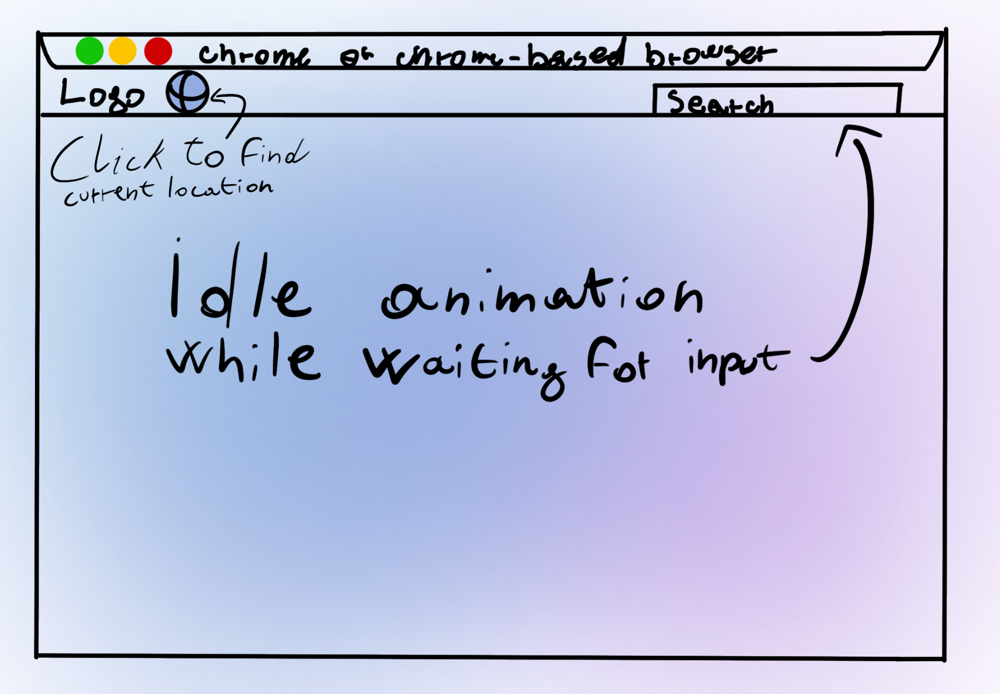
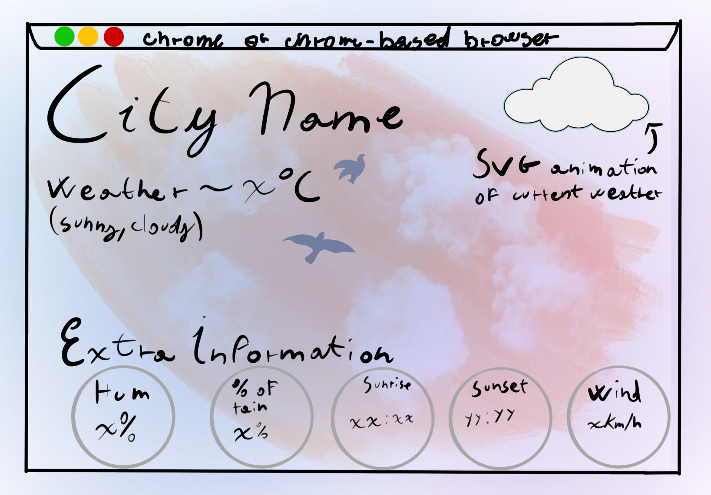

# Weathery

Weathery is an open-source website that provides a weather forecast for cities, which can be found via geopositioning or manual input.

---

#### API used:
- [Geoapify](https://www.geoapify.com) - Get Address by Coordinates
- [Weather API](https://www.weatherapi.com) - Forecasted and Historical Weather
- [Unsplash](https://api.unsplash.com) - Random Photo from Collection

*Special thanks to [amCharts](https://www.amcharts.com/free-animated-svg-weather-icons/) for providing the SVG animated icons.

---

Note: this is a school project, we have to answer some questions for different criterias. 

- Criteria A

    **Q: Explain what you are going to implement.**  
    We considered implementing three distinct APIs: geolocation, weather, and photo picker. Geoapify provided the geolocation, or more specifically, reverse geolocation, which extracts the coordinates to determine the current city. The weather API obtains the daily forecast. Unsplash's photo picker selects a random image from a collection of photos (which may be rain, sun, etc.). Let's not forget the most fundamental component: Axios! It receives the URL with a promise and returns a JSON containing all data; to display the information on the page, we will change the `innerHTML` of each element.  
    We wanted the website to look as cool as possible, which is why the background is a moving gradient (when receiving input) and the photo is responsive. We also changed the font from Bootstrap's default one (Helvetica Neue, Apple-style) to Product Sans (Google-style) using `@font-face`.

- Criterion B

    
    Here you can see how the website should have looked. The home is very simple: there's an animation (which changes based on the action), a button for searching via location, and other two elements to search manually: a field text input and a button.
    
    Once the city has been found, there will be one big heading saying the name of the city. A subhead where is written the current weather condition with the temperature in Celsius; there's also an SVG animation. Finally, there are other divs for extra information (sunset, sunrise, etc.).

- Criteria D

    **Q: What was the most challenging parts of your project? What are possibile future improvements are presented?**  
    The most challenging part was working with promises and displaying the info on the HTML page.  
    About promises: the concept that confused us was about the '.then' statement. Why? We attempted multiple times to obtain information (such as the temperature) from the promise outside the function called in the '.then' statement, which returned a pending promise and a fatal bug.  
    Then there was the issue of calling a function if there was an error with the promise. After running out of ideas, we asked our amazing teacher who introduced us to the '.catch' statement: a lifesaver, to say the least.  
    Displaying the info on the HTML page wasn't difficult, but time-consuming: we had to declare a constant for almost every element, which led to 20 lines only of constants and variables.  

    What are we forgetting? CSS, of course! Who doesn't like spending hours just positioning the elements? This is where Bootstrap helps a lot, but still, we had to work a lot, but we like the UI/UX a lot!  

    Of course, just like any other project, there are always aspects that can be improved. The code could always be more tidy and efficient. We could add more features, such as more SVG animations depending on the time of day, or the temperature of the location. There could also be a part of the website which displays the current time at the location. Adding some text which clearly shows where the city is located might also better the user experience. 
